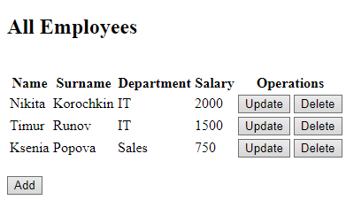
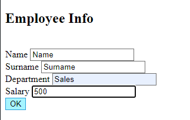
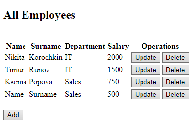
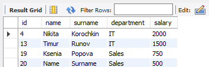
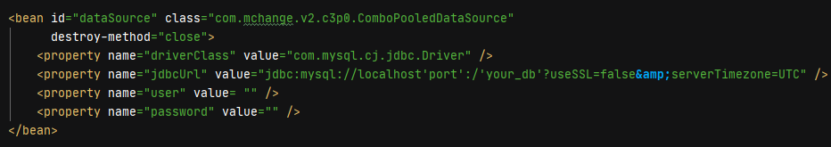

# CRUD

## Описание
CRUD Spring MVC приложение для взаимодействия с объектами в БД при помощи Hibernate. 

Возможности и опции:
  
   1. Вывод на экран списка всех работников, находящихся в определенной таблице в БД
   2. Удаление работника
   3. Добавление нового работника
   4. Изменение информации о работнике 
---
В главном view отображается список всех работников. Все операции производятся при нажатии на определенную кнопку в графе Operations или Add



При добавлении нового работника пользователь попадает на страницу с другим view, где необходимо указать данные



После нажатия кнопки ОК новый работник будет добален в таблицу в БД, пользователь снова увидит главный view, где уже будет отображаться новый работник. 



В базе данных новый работник тоже отображается, значит добавление прошло успешно.



----
## Технологии
Spring MVC, AOP, Hibernate, Lombok, Maven, JSP, MySQL, Apache Tomcat 9.

---

## Запуск

1. Подготовить БД и таблицу
   
   Создаем таблицу `employees` в БД с нужными полями:

```sql
USE your_db;

CREATE TABLE employees (
  id int NOT NULL AUTO_INCREMENT,
  name varchar(15),
  surname varchar(25),
  department varchar(20),
  salary int,
  PRIMARY KEY (id)
) ;

INSERT INTO your_db.employees (name, surname, department, salary)
VALUES
	('Maksim', 'Reus', 'IT', 500),
	('Oleg', 'Ivanov', 'Sales', 700),
	('Nina', 'Sidorova', 'HR', 850);
```        


2. Клонировать репозиторий `$ git clone https://github.com/NikitaKorochkin/CRUD.git'`  

3. Открыть проект в IDE. Ввести данные в `applicationContext.xml`



4. Настроить Apache Tomcat 
 
   Данный проект запускался на 9 версии Tomcat

5. Старт сервера из IDE

   После успешного старта вы окажетесь на странице, описанной во view `all-employees.jsp`,
   если этого не произошло введите этот адрес вручную http://localhost:8080/spring_course_mvc_hibernate/  


